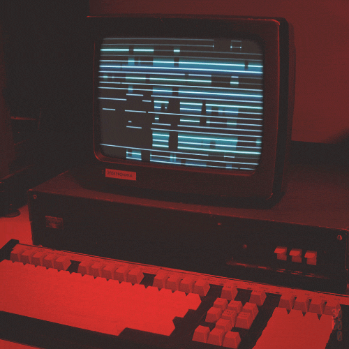

|

🌱 I’m currently working on [BoxChat📦](https://github.com/EderickLFbox_chat)

👀 Looking for work!
 
📖 Reading on
 <ul><li>React threejs</li><li>Blender</li><li>Netlify</li><li>Discord Bots</li></ul> 
🏓 Interests
<ul><li>Gaming</li><li>Gym</li><li>Cooking</li></ul>
| |
|-|-|

             

# Weather Loaf 🍞 | [Live](https://weatherloaf.netlify.app) | [Repo](https://github.com/ByteZi/box_chat) |

WeatherLoaf, a ReactJS project that utilizes the <a href="https://openweathermap.org/">OpenWeatherAPI </a>

 

WeatherLoaf calls the API using city names in order to display Current AND next 7 day forecast

 

This project was created in order to gain further understanding on API calls

 

Data will not load due to limited API calls in some cases

# BoxChat 📦 | [Live](https://boxchatelf.netlify.app) | [Repo](https://github.com/EderickLF/weather-api) |

BoxChat, A reactJS project that uses <a href="https://developer.mozilla.org/en-US/docs/Web/API/WebSockets_API">WebSockets</a> 

 

This project simulate a real time web chatting application sending data from User -> Client -> User

 

BoxChat was created to have a further understanding on how WebProtocols happen on the backend

