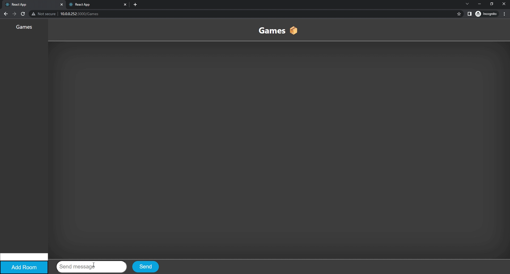

<h1 align="center">Ederick Fernandez</h1>
<h3 align="center">A passionate frontend developer from India</h3>

- 🌱 I’m currently working on [BoxChat](https://github.com/EderickLF/box_chat)
- 📖 Reading on
    ReactNative
    Unity / Unreal Engine
- 🏓 Hobbies
    Games 
    Gym
    Cooking
- 📨 Edericklf@gmail.com
- 📄<a href="#">My Resume!</a>

<h3 align="left">Connect with me:</h3>

<h3 align="left">Tech :</h3>

             

<h1>Projects</h1>

    <a href="https://github.com/EderickLF/box_chat"><h3>WeatherLoaf</h3></a>
    
WeatherLoaf, a ReactJS project that utilizes the weather-API. The website enables the user to check the weather of a city via searching the name

    

    <a href="https://github.com/EderickLF/weather-api"><h3>BoxChat</h3></a>
    
BoxChat, A reactJS project that uses [WebSockets](https://developer.mozilla.org/en-US/docs/Web/API/WebSockets_API). BoxChat enables realtime user chatting within rooms that can be created. 

    

